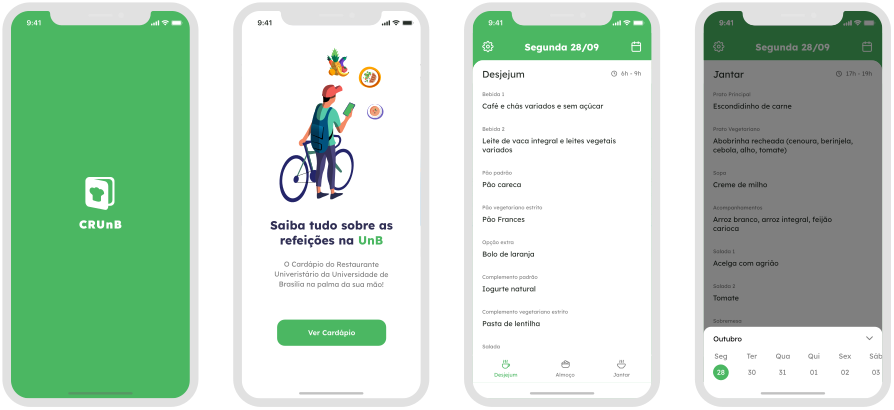

<p align="center">
    
</p>

<h1 align="center">UnBRU</h1>

<p align="center">Aplicativo que disponibiliza o cardápio do Restaurante Universitário da Universidade de Brasília</p>

<div align="center">
    
    
    
    
    
</div>

## Objetivo

O projeto tem como objetivo facilitar o acesso aos estudantes da Universidade de Brasília ao cardápio do Restaurante Universitário com a praticidade de um app, visto que atualmente o cardapio pode ser visualizado apenas por um pdf

## Telas do MVP



## Instalação

- Pré-requisitos:
<a href="https://nodejs.org/en/">Nodejs</a>, <a href="https://docs.expo.dev/get-started/installation/">Expo</a>, <a href="https://expo.dev/client">Expo Go</a>

1. Instale as dependêcias do projeto

```bash
npm install
```
2. Incie o projeto

```bash
expo start
```

## Contribuição
